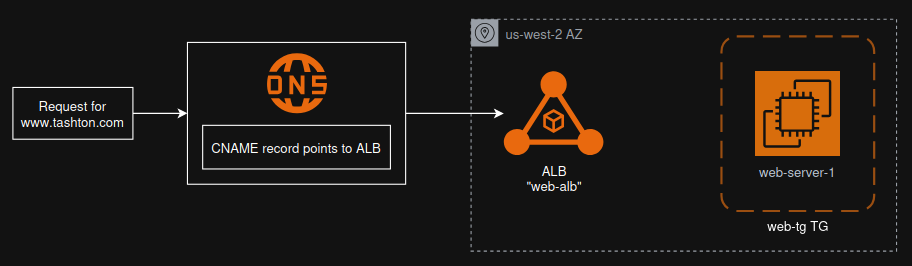

# tashton.com-aws-architecture
AWS Architecture and IaC assets for tashton.com.

## Summary
This repo describes the iterative process used to set-up the AWS infrastructure for tashton.com. It has been matured in phases, with a more complete architecture being accomplished with each subsequent phase.

## Phase 0
### Goal
Stand-up an infrastructure, secure a domain name, set-up a server and networking.

### Overview

## Resource Links
* Flow Chart: https://app.diagrams.net/#G13w9L3uKM1iaJSPvzxjTAjVbNk1iFcorY#%7B%22pageId%22%3A%22RdRQKKPnWW5S5XYXU1eC%22%7D
